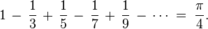
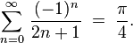

#**workingActors** 
##an introduction to Actors, workers, and Scala programming

#### DOING MANY THINGS AT THE SAME TIME
Writing software to do many things at the same time is concurrent programming. With adequate hardware, concurrent software can run in parallel. In the history of computer science various methods have been invented to support concurrent programming including: explicit synchronization of shared distributed memory; Actors; process algebras; software transactional memory; and dataflow. 

Since traditional synchronization with locks can lead to deadlocks or race conditions, other methods of concurrent programming are gaining favor. Erlang popularized the Actor model. Go is popularizing a channel model. Clojure is popularizing software transactional memory. Modern cloud and cluster computing are popularizing data flow. These methods can be combined, as appropriate, in big data stacks. 

This demo focuses on the Actor model which is popular with Scala and also used within data flow systems, like Spark. 

#### WHY ACTORS MATTER
The Actor model is a key method of concurrent computing that uses message passing to limit deadlocks or race conditions. Actors can be especially effective in modern cluster computing.

Actors are simple automata with an incoming message queue that can, in response to a message, process the message, create other actors, send messages to actors and designate how to handle the next message received. Messages may arrive out of order. The actions of actors are inheriently concurrent.

The work of multiple actors can be pushed, pulled or streamed.

#### MILLIONS OF COMPUTATIONS BY OVER A THOUSAND ACTORS
This program is for teaching an introduction to Actors, workers and Scala programming. The Actors work round-robin, calculating the sum of an infinite series that converges to pi. Each actor is assigned a sequence of terms in the series from left-to-right and a series of calculations within the sequence. The work is compute-bound (sum of the Madhava-Gregory–Leibniz series).

Faster methods exist for computing pi, but this slower method is ideal for explaining the Actor concept. The goal of this work is to lay a foundation for later demos in pull and stream-oriented cluster computing. For further explanation, please see the companion training video.

The program organizes 1100 Actors, to cover 20,000 adjacent sequences of an infinite series, from left-to-right. Actors are assigned and reassigned round-robin, each working 20,000 steps from left-to-right within a sequence, until 400,000,000 terms in the series have all been computed. 

The sum and difference of all these numbers converges (slowly) towards pi.

#### WATCH THE LIVE LOGGING
When run, the console will log each actor's assignment to a sequence. ENTER shows where each actor starts work on an assigned sequence in the series. EXIT shows the result of an actor computing 20,000 steps within a sequence.

#### LOOK FOR THE RESULT AND CHART
See the final result and the long-tail contribution of the last 1000 actors.